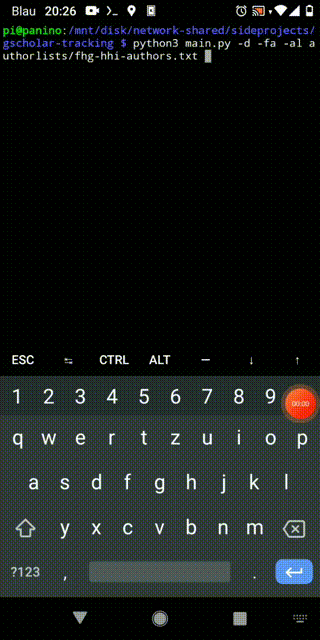
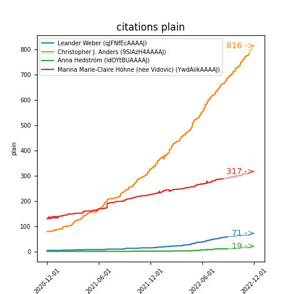

# A Tool for More Fine-Grained Google Scholar Stat Tracking
Google scholar is tracking statistics such as citation counts for authors and papers. However, it only provides the number of total current citations, as well as the total citations of the current and past year. As someone who likes to watch lines go up, this was not enough *fine grained* info for me.

Knowing that google scholar updates its stats page every second day, I have thus created this neat little tool to track the citation and citation index progression of my own and my colleagues' and co-authors' work. I am very aware, that this is nothing else but a private d***k measuring contest ;)

For now, I will let this tool run every second day and auto-commit stats as a cron job on a raspberry pi sitting at home.

~~In the near future, there will be an extension for tracking paper info (for all authors?). This will probably require some more sparse data logging, to avoid an explosion of text data.~~
With the number of papers for all authors growing as it does, such a request by far exceeds the google scholar API qouta. Thus, this planned feature will be scrapped.

At some later time, once enough dated data points have been gathered, I will add functionality to draw some neat lines.

## How to use this tool
First, clone this repo. Then, call `bash install.sh`, which in turn will install all required packages via `pip`.

#### Collecting Data
The tool can then be neatly used from command line. The following help text should be self-explanatory:

```
$ python main.py --help
Usage: main.py [OPTIONS]

  This script collects author information on google scholar and writes the
  respective current reference count to a dated list. This allows for a more
  fine-grained tracking of citations compared to the yearly/current overview
  provided by google scholar itself.

Options:
  -a, --authors TEXT           The name or google scholar id of the authors to
                               track on google scholar. Multiple uses
                               possible.
  -al, --author_list TEXT      Should point to a file of newline-character-
                               separated author names or ids. Multiple uses
                               possible
  -o, --output_directory TEXT  Output directory of the stats to collect. A
                               file will be created or appended to, named
                               after the authors' google scholar ids.
  -d, --dry_run                Set this flag to only collect data without
                               writing. Prints the collected data to the
                               terminal instead. Author search by name also
                               prints the profile picture to console.
  -fa, --fetch_async           Set this flag to fetch author data
                               asynchronously from the web. Default behaviour
                               is sequential processing.
  -c, --commit                 Set this flag to auto-add and commit any change
                               in the given output directory to your CURRENT
                               BRANCH and local git.
  -k, --keep_log               Set this flag to keep the scholar.log and
                               geckodriver.log created by scholarly
  --help                       Show this message and exit.
```

I personally am running the tool as a cron job, as
```
python3 main.py -al authorlists/fhg-hhi-authors.txt -al authorlists/coauthors.txt -o /some/location -c -fa
```

When running with `-d` or `--dry_run`, author information is collected, but not written to disk. Instead the author info is shown for, e.g., making sure the right author has been identified, in case of author name ambiguites.




### Visualizing Collected Data
The file `plot.py` has been written as a rudimentary visualization script for showing the collected data (with lots of room for improvement):

```
$ python plot.py --help
Usage: plot.py [OPTIONS]

  This script collects (already downloaded) author information from google
  scholar located on the disc

Options:
  -a, --authors TEXT             The name or google scholar id of the authors
                                 to visualize. Multiple uses possible.

  -al, --author_list TEXT        Should point to a file of newline-character-
                                 separated author names or ids. Multiple uses
                                 possible

  -ad, --author_record_dir TEXT  Shuold point at the folder containing all the
                                 pre-collected author data.

  -o, --output_file TEXT         Output file of the stats to collect. Only
                                 produces file if set.

  -l, --list                     Causes the script -- instead of plotting --
                                 to list all the available author info(s) in
                                 the available files.

  -s, --show                     Shows the plotted data.
  -w, --what TEXT                What data to plot? default: cited . all
                                 options: ['cited', 'h', 'i10']

  -h, --how TEXT                 How to present the data? default: plain . all
                                 options: ['plain', 'delta_year',
                                 'delta_month', 'growth_year', 'growth_month']

  -mnd, --min_date TEXT          min date. plot no date earlier than this
                                 date, to be given in %Y-%m-%d format.

  -mxd, --max_date TEXT          max date. plot no date later than this date,
                                 to be given in %Y-%m-%d format.

  -figs, --figsize INTEGER       Specifies the size of generated figure.
  -fs, --fontsize INTEGER        Specifies the size of fonts used in the
                                 figure.

  -nx, --num_xticks INTEGER      Number of euqually spaced x-ticks. can be int
                                 or strings (TODO: 'year', 'month')

  --help                         Show this message and exit.
```

The example call
```
python plot.py -a "Leander Weber" -a 9SIAzH4AAAAJ -a ldOYtBUAAAAJ -a "Marina Vidovic" -mnd 2020-12-01 -mxd 2022-12-01 --fontsize 7
```
shows plain citation numbers in a bi-daily resolution for a select group of researchers, some of which are identified by google scholar id (and thus directly read from disk) and some of which are resolved by the scholarly package by name, from december 2020 to december 2022, as shown below:

